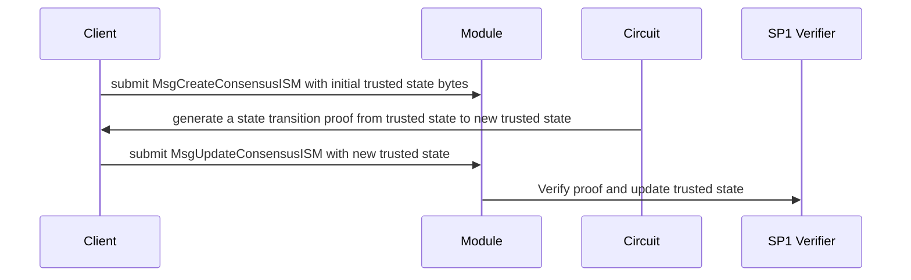

# Generic Groth16 (SP1) Verifier for State Transition and Consensus Proofs
This repo is a prototype / POC of a generic SP1 proof verifier module that extends [Celestia app](https://github.com/celestiaorg/celestia-app/tree/feat/ethereum-consensus).
The new branch has been merged into this [ZKISM branch](https://github.com/celestiaorg/celestia-app/tree/feature/zk-execution-ism) 

## Motivation and Context
In order for Celestia to become a hub for connecting all sorts of different chains, we must ensure the availability of trusted state roots.
Each consensus model may require its own implementation of a consensus client, but it will practically always be a transition from `previous_trusted_state` to `new_trusted_state`.
The `Verifier` module that was added to `celestia-app` for this POC allows anyone to deploy an on-chain verifier for SP1 Groth16 State Transition proofs, enabling Celestia
to serve trusted roots for all kinds of different chains (Solana, Ethereum, L2s, ...).

## Limitations

### Celestia
This project leverages the generic state transition verifier and hyperlane message proofs against the incremental tree, to relay messages from
Ethereum to Celestia. Similar to other ZK Light Clients, the trust assumption lies in the circuit implementation and trusted state + sync committee. 

### Groth16
Currently the verifier only supports SP1 Groth16 proofs that require 2 verifying keys, one that is project specific and a wrapper key specific to SP1.
Risc0 works similarly but is not supported out of the box because of differences in versioning. It should be possible to extend the verifier to 
support Risc0 by ignoring the versioning.

For generic (non-ZKVM) Groth16 proofs, we will have to extend the implementation to handle cases where there is just one verifying key and call the 
Groth16 verifier directly. However it seems likely that most ZK light client that we will integrate use SP1, Risc0 or another ZKVM that has a dual verifying-key requirement.

## Deployments
### Sepolia

| Contract Name | Address |
|--|--|
| domainRoutingIsmFactory | 0xBB9A8711EfAAF49A8bf060F2D0A6341C5c352838 |
| mailbox | 0xC591542b7C43f1E79Df47526F7459Ed609Aff2a3 |
| merkleTreeHook | 0xA82571C75164B76721C4047182b73014072E3D9B |
| proxyAdmin | 0xF16558A84483C471Aa589Ef337414Ff0C8d93358 |
| staticAggregationHookFactory | 0xF9d4F726FB05AED56A58D0C5E0c16CEaAE7F37e5 |
| staticAggregationIsmFactory | 0x083A11101c4003b3E5d56cEE2dAdA2ba95a2393b |
| staticMerkleRootMultisigIsmFactory | 0x62139DC56A302b869F681e5272F5e90AD23b6D24 |
| staticMerkleRootWeightedMultisigIsmFactory | 0xbf1eF820C0Fe9CBCA51a9640d98aCf35205C6805 |
| staticMessageIdMultisigIsmFactory | 0xA0ca6F96BbFF5951752EB1E9c890d7Ee844454c8 |
| staticMessageIdWeightedMultisigIsmFactory | 0xCC2bAea9092f0D027434D1BbF5b786a812671b8A | 
| testRecipient | 0xdFa2514265631d3aAb6A2a416bc524b44809Ec4b | 
| validatorAnnounce | 0xf042c4bd2d15c060359014c9E16dDF226dc33561 |


## Implementation

### Mock Circuit

The Mock Circuit uses a real SP1 ZK Program to simulate what a state transition may look like. However any Program that uses the same input and output will be supported as long as the correct verifying key is supplied during the instantiation of the module.


Circuit code:
```rust
pub fn main() {
    let input: CircuitInput = sp1_zkvm::io::read::<CircuitInput>();
    // in a real application: verify other inputs against trusted state form input
    let mut new_trusted_state = input.trusted_state.clone();
    new_trusted_state.new_root = [1; 32];
    new_trusted_state.new_height = new_trusted_state.previous_height + 1;

    let trusted_state_serialized = bincode::serialize(&input.trusted_state).unwrap();
    let new_trusted_state_serialized = bincode::serialize(&new_trusted_state).unwrap();
    let mut state: Vec<u8> = Vec::new();
    let trusted_state_len = trusted_state_serialized.len() as u64;
    state.extend_from_slice(&trusted_state_len.to_le_bytes());
    state.extend_from_slice(&trusted_state_serialized);
    state.extend_from_slice(&new_trusted_state_serialized);

    sp1_zkvm::io::commit_slice(&state);
}
```

### Binary Flow




### Types

```
MsgUpdateConsensusISM:
    public_outputs = length_prefix || trusted_state || new_trusted_state
```

The length_prefix is the little-endian encoded u64 length of trusted_state. The length
of new_trusted_state is arbitrary, but will usually match that of trusted_state.

In the verifier module we store only new_trusted_state after verifying the proof against the current trusted_state (which is initally set when submitting MsgCreateConsensusISM).

## Instructions to run the POC

1. Clone the repo
```bash
git clone git@github.com:celestiaorg/mock-zk-consensus-client
```

2. Clone the celestia-app fork
```bash
git clone git@github.com:celestiaorg/celestia-app
cd celestia-app
git checkout feat/ethereum-consensus
git pull
./build.sh

cd mock-zk-consensus-client
docker compose up
```

To stop the celestia-validator node:
```bash
docker compose down -v
```

This will build the `celestia-app-standalone` docker image locally.

3. Run the binary

The binary will:

- create a new Generic State Transition Verifier from the ZKISM module
- generate a ZKP using the mock client (real SP1 Groth16 proof)
- submit the proof and update the Trusted State Bytes in the Verifier module instance

```bash
cargo test -p prover-service --release
```

4. Query for results

You can query the verifier at any time using:

```bash
docker exec -it celestia-validator /bin/bash
celestia-appd q zkism verifiers
```

This will list all verifiers (should be one) and also show their trusted state.

### SP1 Helios Integration
This repository contains a wrapper circuit and service that can be used to update the `trusted_state` in the Generic Verifier periodically. The Generic Verifier module was first introduced 
in [this](https://github.com/celestiaorg/celestia-app/pull/6266) PR on `celestia-app` and has since been improved. Thanks to the generic design any state transition can be used in combination with Hyperlane message verification, using a custom ZKISM ([Interchain Security Module](https://docs.hyperlane.xyz/docs/protocol/ISM/modular-security)).

The prover service will initially generate a raw Helios proof and instantiate the Verifier on Celesita from the proof outputs.
Moving forward it will generate wrapped proofs using the circuit in `crates/circuit` to update the `trusted_state`, following the encoding rules
of our verifier.

## Encoding Rules
Proof outputs are structured such that `length_prefix` || `trusted_state` || `new_trusted_state`, where `length_prefix` are little-endian incoded bytes of a u64 and `trusted_state` and `new_trusted_state` are both the raw bytes of the SP1 proof outputs.

## Running the Helios Prover
```bash
cargo run -p prover-service --release
```

## Path to Mainnet
If we want to support the integration of new consensus clients on Mainnet, then we might want to extend the verifier to also support Risc0 proof verification, such that we support the most common implementations of ZK Light Clients. We might be able to ditch versioning (which does introduce some risks, so needs discussion), or just add a Ric0 verifier implementation, that also wraps around the underlying Groth16 verifier.

Supporting generic Groth16 proofs should be straightforward, but needs discussion if we think it's a necessary addition.

Since this branch of `celestia-app` is based off our ZKISM implementation and the generic StateTransitionVerifier was added to the ZKISM module, we might want to de-couple and launch just the StateTransitionVerifier on mainnet before introducing a ZKISM, with the goal of supporting ZK Light Client integrations like SP1 Helios.

All of the above needs discussion.
